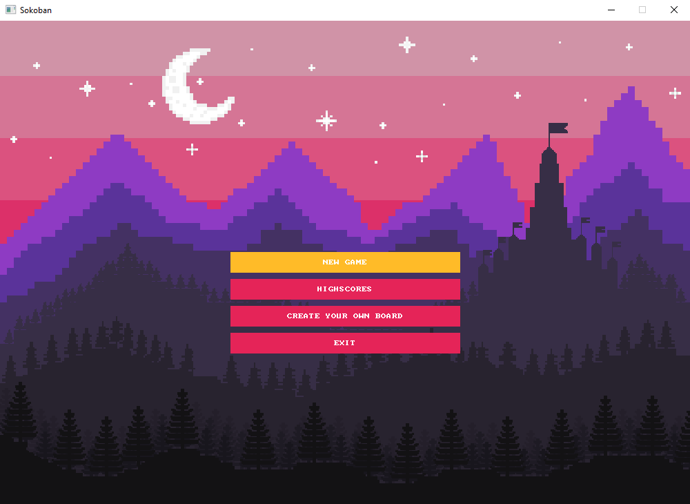
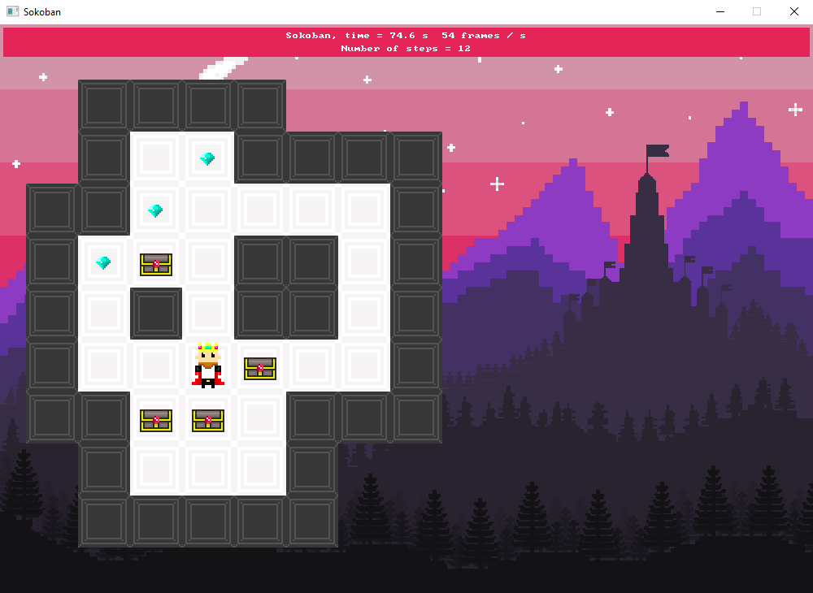
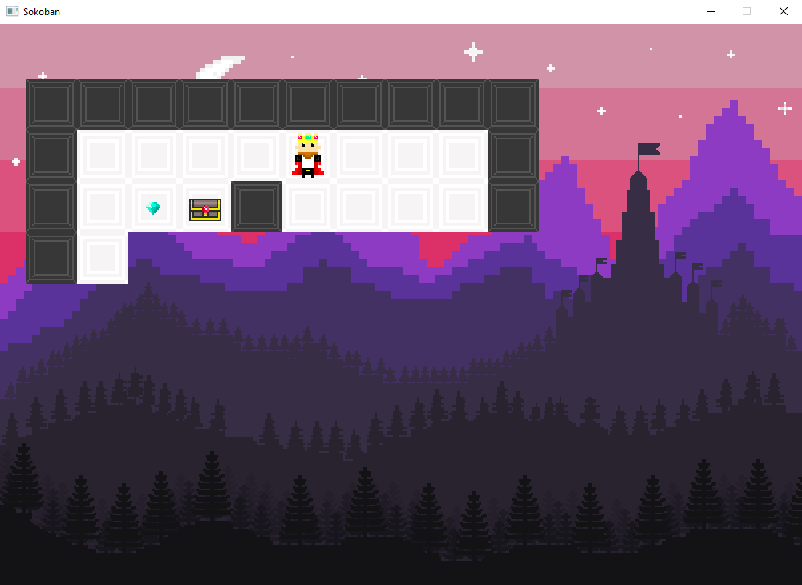


# Sokoban

## Sections

 - [Visuals](#visuals)
 - [Description](#description)
	 - [General](#general)
	 - [Main features](#main-features)
	 - [Programming languages and libraries](#programming-languages-and-libraries)
 - [Usage](#usage)
 
## Visuals

**Menu**

**Gameplay**

**Map creator**

## Description

### General

Sokoban game made for the university project.

### Main features

 - Sokoban mechanics
 - Level creation
   - In a **board creator** click a character to create a tile:
	You can't delete a tile once you click it.
	**o** - wall
	**d** - diamond
	**c** - chest
	**f** - floor
	**8** - hero.
	 Click e to go back to the menu. 
 - saving the scores
 - retro graphic
 
### Programming languages and libraries

 - C++
 - SDL2

## Usage

 - playing the game
